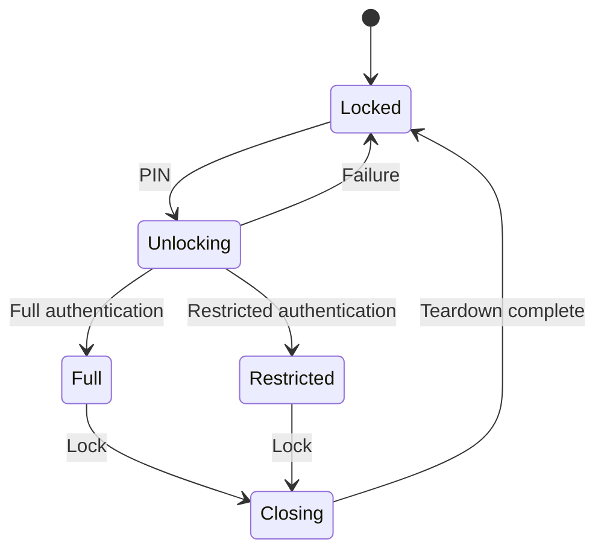

# Biremis: задание агенту-архитектору

Версия: 1.0 — 27 сентября 2026 года.
Основание: обсуждение Restricted Mode для форка Telegram-iOS.
Статус: пересмотренный архитектурный brief, а не подтверждение реализуемости или безопасности.

## 1. Твоя задача и границы первого прохода

Ты — архитектор проекта Biremis, Telegram-клиента с двумя PIN и двумя состояниями доступа к одному аккаунту. Начни разработку с исследования фактического репозитория, проверки реализуемости модели безопасности и подготовки задач реализации.

Первый проход — анализ и проектирование. Разрешено создавать перечисленные ниже отчёты в `restricted_mode/architecture/`. Не изменяй исходный код, сборочные настройки, зависимости, entitlements, существующие требования или пользовательские конфигурации. Не создавай автоматически предложенные в старой беседе модули: их необходимость ещё предстоит доказать. Не запускай несколько агентов автоматически; задания для исполнителей подготовь как документы.

Прочитай применимые `AGENTS.md` и имеющиеся:

- `restricted_mode/SPEC.md`;
- `restricted_mode/THREAT_MODEL.md`;
- `restricted_mode/SECURITY_INVARIANTS.md`.

Эти три документа, если существуют, являются авторитетными требованиями проекта. Этот brief не разрешает молча изменять их или ослаблять инварианты. При противоречии зафиксируй конфликт, предложи варианты решения и заблокируй только зависимые работы. Продолжай независимый анализ. Если документов нет, подготовь проекты требований в каталоге архитектуры; не выдавай их за уже согласованные.

При отсутствии соответствующего авторитетного документа проект SPEC оформляй в `restricted_mode/architecture/01_REQUIREMENTS_REVIEW.md`, проект модели угроз — в `restricted_mode/architecture/03_THREAT_MODEL_REVIEW.md`, проект инвариантов — в `restricted_mode/architecture/06_SECURITY_COVERAGE.md`. Помечай эти проекты `DRAFT / NOT APPROVED`. Они не становятся источниками требований без решения владельца. Отдельные копии SPEC, THREAT_MODEL и SECURITY_INVARIANTS в каталоге архитектуры не создавай.

Brief содержит все исходные продуктовые предположения для первого прохода. Если предыдущие предложения отсутствуют в репозитории, не восстанавливай их по догадкам; сравнение с ними отмечай как недоступное.

Оцени актуальный код на конкретном commit. Предыдущая переписка, названия классов, ссылки на `master` и старые Markdown-описания — ориентиры поиска, а не доказательства устройства форка. Автор этого brief не инспектировал локальный форк пользователя.

## 2. Цель продукта

| Область | Требуемое поведение |
|---|---|
| Full PIN | Открывает полное состояние Telegram |
| Restricted PIN | Открывает состояние без выбранных скрытых диалогов и их приватной истории |
| Обычная работа | Full сохраняет поведение upstream, кроме явно согласованных изменений блокировки и безопасности |
| Настройки скрытия | Доступны только после Full PIN |
| Новые диалоги | По последней обсуждённой модели blacklist новые не скрытые диалоги появляются как обычно |
| Блокировка устройства | После системной блокировки следующий доступ к приложению требует PIN |
| Биометрия | Face ID/Touch ID не заменяют PIN приложения; это не запрет биометрии самого iPhone |
| Переключение | Только через завершение текущей сессии и повторную аутентификацию |
| Защита | Требуется рассмотреть доступ к файловой системе разблокированного iPhone, а не только UI |
| Внешний вид | В Restricted нет пунктов управления скрытыми чатами и признаков их истории в обычных сценариях |

Не смешивай blacklist скрытых диалогов с Telegram Blocked Users: скрытие не должно само по себе блокировать собеседника на сервере. Старое пожелание блокировать неизвестные номера, если оно есть в SPEC, необходимо согласовать с последним правилом о появлении новых диалогов. Не выбирай один вариант молча.

Текущий предмет работ — iOS. Android требует отдельного исследования.

## 3. Что исправлено по сравнению с предыдущей архитектурой

### 3.1. Проверка безопасности должна предшествовать широкому UI-прототипу

Прежний порядок «сначала все UI-фильтры, потом storage и ingestion» откладывает главный риск на конец. Новый порядок: baseline → модель угроз → исследование ключей/авторизации/синхронизации → ограниченные технические эксперименты → архитектурное решение → вертикальная реализация.

UI-прототип допустим на синтетических данных в отдельной экспериментальной ветке. Он не считается безопасным MVP и не удовлетворяет filesystem threat model. Если действующие инварианты запрещают даже такой прототип, сначала зафиксируй конфликт; не обходи запрет переименованием этапа.

### 3.2. Две базы — кандидат, а не готовая архитектура

Раздельные Full/Restricted Postbox и MediaBox дают возможную границу локального хранения. Они не решают автоматически авторизацию, сетевые запросы, состояние updates, секретные чаты и восстановление Full после работы в Restricted.

Проверь, можно ли безопасно создать отдельные runtime-контексты и базы в текущем TelegramCore без скрытого открытия FullStore и без некорректного копирования состояния аккаунта. Не предполагай, что достаточно подменить путь к Postbox.

### 3.3. Авторизация Telegram — отдельная критическая граница

Telegram связывает авторизацию пользователя с ключом клиента [S1]. Из этого следует архитектурный риск: если Restricted runtime располагает пригодной к использованию полной авторизацией аккаунта, локальная фильтрация сама по себе не запрещает запросить скрытую облачную историю.

Нужно отдельно оценить:

- извлечение auth material из файлов;
- его доступность через Keychain на устройстве;
- использование полномочий приложения без извлечения ключа;
- произвольные RPC при модификации процесса или клиента;
- получение истории через легальные пути самого приложения.

Не приписывай Telegram наличие авторизации, ограниченной выбранными чатами, без доказательства. Если сочетание «полноценный онлайн Restricted» и «защита от атакующего с полномочиями процесса/учётной сессии» не обеспечивается, это блокирующий конфликт требований. Offline Restricted и изменение модели угроз — варианты для решения владельца, не разрешённые по умолчанию компромиссы.

### 3.4. HMAC-список не делает blacklist неизвестным Restricted runtime

Если процесс знает ключ HMAC и может проверять кандидаты PeerId, он может проверять принадлежность известных peers скрытому набору. Токены скрывают прямое представление идентификаторов, но не дают гарантию нераскрытия списка от того же процесса. Размер и изменения набора также могут раскрывать метаданные.

Нужно определить, защищаем ли мы содержание истории, связь аккаунта с диалогом, идентичность собеседника или сам факт наличия второго режима. Эти свойства различны. Случайные имена файлов и два зашифрованных descriptor не доказывают неотличимость от обычного Telegram.

### 3.5. Короткий PIN и шифрование descriptor

Успешная AEAD-расшифровка descriptor может служить проверкой догадки PIN при офлайн-переборе. KDF удорожает попытку, но не увеличивает энтропию короткого PIN. UI-задержки не защищают скопированный контейнер.

Не используй самодельную формулу HKDF как готовый протокол. Подготовь модель envelope encryption: случайные ключи данных, отдельные ключи их обёртки, проверенный password KDF, версионирование формата, уникальные nonce, аутентификация метаданных, смена PIN и ротация. Конкретные алгоритмы и параметры выбираются после анализа доступных библиотек и измерений на целевом устройстве.

Device-bound secret и Secure Enclave/Keychain — кандидаты с явно описанными гарантиями. Нельзя автоматически переносить защиту системного кода iPhone на PIN приложения или обещать аппаратный лимит перебора произвольного PIN. Укажи поведение при потере ключа, восстановлении backup, переносе устройства и забытом PIN.

### 3.6. Notification extension не является гарантированным средством подавления

Apple документирует возврат к исходному содержимому уведомления при незавершённой обработке extension [S3]. Для получения уведомлений без отображения существует отдельный entitlement [S4]. Его наличие у upstream не означает доступность для подписи форка.

Пустые поля, удаление уведомления после доставки и текст «новое сообщение» не доказывают отсутствие следа события. Проверь исходный APNs payload, доступные entitlements, таймаут, crash и отсутствие запуска extension, badge, звук, вложения и метаданные. Отдельно исследуй VoIP/CallKit. Если требование недостижимо на выбранной подписи — блокирующий вопрос, а не скрытое ослабление.

### 3.7. Lock lifecycle и память требуют проверяемого протокола

Событие protected-data относится к доступности защищённых файлов [S5]; одного callback недостаточно для доказательства всей логики блокировки. Проверь background, inactive, suspension, kill/relaunch, несколько сцен и возвращение после разблокировки.

Консервативный кандидат — закрывать доступ и требовать PIN при каждом уходе в background; это изменение UX, его нужно обозначить как предложение. Если требуется сохранять сессию при обычном переключении приложений, докажи обнаружение системной блокировки во всех поддерживаемых сценариях. При неопределённости доступ должен оставаться закрытым.

Обнуление переменной Swift или освобождение AccountContext не доказывает стирание всех копий ключей/контента. Нужны анализ времени жизни, отмена задач и подписок, закрытие handles и честное описание остаточных рисков памяти.

### 3.8. Поиск canary-строк — только один тест

Ноль совпадений не доказывает отсутствие утечки: данные могут быть бинарными, сжатыми, закодированными или зашифрованными доступным атакующему ключом. Требуются декодирование соответствующих форматов, аудит ключей, проверка медиа, остатков, резервных копий и возможности повторного получения данных по сети.

## 4. Сначала формализуй модель угроз

Подготовь таблицу возможностей атакующего. Не объединяй все варианты словом «filesystem».

| Уровень | Возможности, которые нужно рассмотреть отдельно |
|---|---|
| T1 | Разблокированный iPhone и Restricted UI, штатная навигация, ссылки, Share |
| T2 | Копия sandbox/App Group, файлов и доступных резервных копий; офлайн-анализ |
| T3 | Доступ к Keychain/использованию ключей или полномочий приложения на устройстве |
| T4 | Debugger, memory dump, instrumentation, изменение клиента, произвольные RPC |

Сформулируй для каждого уровня: предпосылки, защищаемые активы, способы атаки, достижимые гарантии, ограничения и тесты. Не объявляй T3/T4 исключёнными без решения владельца, если исходное требование их допускает.

Отдельные активы: тексты, медиа, идентификаторы, факт переписки, blacklist, Full keys, MTProto auth keys, secret-chat keys, sync metadata, журналы, сетевые следы и признаки существования второго хранилища.

Отдельно укажи границы доверия к iOS, Telegram servers, Apple push infrastructure, другим устройствам аккаунта и внешним приложениям. Уже экспортированное в Photos/Files или доставленное на другое устройство нельзя обещать удалить очисткой sandbox.

## 5. Обязательное исследование репозитория

Зафиксируй commit SHA, ветку, upstream, состояние рабочего дерева, версии submodules, платформы и фактически доступные build tools. Не печатай API secrets, tokens, приватные ключи и содержимое личных сообщений. Не обновляй репозиторий и не меняй версии инструментов автоматически.

Проверь наличие успешного baseline: генерация проекта не равна сборке, сборка не равна запуску, запуск simulator не подтверждает push/Keychain/lock на iPhone. Для недоступной проверки укажи «не проверено», причину и воспроизводимую команду/процедуру для владельца.

Если нет подтверждённой сборки исследуемого состояния репозитория, выполни baseline-сборку доступными средствами. Генерируемые артефакты допустимы; изменения исходников и конфигурации для исправления сборки в этот проход не входят. При сбое зафиксируй первую значимую ошибку и продолжай независимый анализ.

Найди реальные точки:

1. Создание account/network/Postbox/MediaBox и получение encryption parameters.
2. Локальное хранение и использование авторизации, включая App Group и extensions.
3. Создание AccountContext, корневого UI и управление app lock.
4. Все записи сетевых данных: updates, RPC results, pagination, difference, background jobs, prefetch, migrations.
5. Chat list, archive, folders, search, contacts, recent peers, forwarding и навигация.
6. Counters, badge, settings statistics, storage usage и network usage.
7. Notification/Share, Siri, widgets, Spotlight, Watch, CarPlay, Live Activities — если присутствуют.
8. Calls/CallKit, stories, forum topics, saved messages, drafts, mentions, linked discussions и shared media.
9. Logs, crash reports, temp files, thumbnails, disk/memory caches и snapshot handling.
10. Multiple accounts, secret chats, logout/login, migrations, backup/restore.

Для каждого вывода приложи `commit + path + symbol`, при необходимости строки, описание data flow и статус: подтверждено кодом / проверено запуском / гипотеза / неизвестно. Наличие имени класса не доказывает покрытие всех путей.

## 6. Решения, которые необходимо спроектировать

### 6.1. Access state и capabilities

Раздели профиль (`full/restricted`) и состояние сессии (`locked/unlocking/active/closing/error`). UI получает только допустимый для сессии набор возможностей, а не универсальный Full account с декоративным флагом.

Базовая последовательность:

Сразу при начале Closing запрети новые чувствительные операции и закрой визуальное содержимое. Не жди окончания очистки для закрытия доступа. Опиши гонки callbacks, cancellation, generation/session IDs, одновременные процессы, ошибки и аварийное завершение. Новый профиль нельзя активировать до безопасного завершения предыдущего.

Не считай app-group флаг «последний профиль Full» полномочием extension открыть FullStore. Предложи явную модель аутентификации, срока действия и отзыва доступа. Для Share при Locked предпочтителен заблокированный вход; автоматическое открытие Restricted без PIN — отдельное решение владельца, не следствие состояния Locked.

### 6.2. Политика видимости

Не ограничивай интерфейс одним `isVisible(PeerId)`. Раздели как минимум разрешения на identity, conversation/history, persistence, navigation, notification и actions. Учитывай account ID и namespace PeerId; для topics/secret chats определи отдельную семантику.

Реши примеры:

- скрытый пользователь пишет в видимой общей группе;
- видимое сообщение содержит forward, quote, mention или reply из скрытого контекста;
- ссылка открывает публичный профиль скрытого собеседника;
- создаётся новое сообщение этому пользователю;
- скрывается группа, канал, бот, topic или secret chat;
- в Saved Messages есть копия сообщения скрытого диалога;
- blacklist изменяется при работающей extension.

Не удаляй автоматически любое упоминание человека, если скрывается только история диалога. И наоборот, не обещай скрыть идентичность фильтрацией только chat list. Составь таблицу ожидаемого поведения и нерешённых продуктовых вопросов.

Новые незаблокированные peers допускаются при валидной политике. Отсутствующая, повреждённая или устаревшая policy не означает «разрешить всё». Опиши безопасное состояние ошибки и восстановление.

### 6.3. Persistence и сетевые ответы

Сравни минимум три кандидата: общий Postbox с фильтрацией (только прототип), два изолированных Postbox, специализированная Restricted projection. Сравни безопасность, совместимость с upstream UI, сложность sync, стоимость миграций, покрытие функций и поддержку обновлений upstream.

До выбора сделай карту всех plaintext/ключевых данных. Шифрование DB не означает шифрование MediaBox, attachments, WAL/journal, temporary files или logs. Не предполагай конкретный формат DB: установи фактический backend и вспомогательные файлы.

Централизованная проверка обязательна до persistence для всех ingress-путей, не только updates: RPC history/search/dialogs, contacts, stories, media, difference, retries, prefetch и background. Вторичная защита нужна при выдаче данных и выполнении действий. Navigation guard — дополнительная проверка, а не универсальная граница безопасности.

Для изменений blacklist опиши транзакционный протокол между policy, DB, медиа и процессами. Единая DB-транзакция не делает файловое удаление и удаление системных уведомлений атомарными. Рассмотри версии policy, закрытие доступа на время операции, staging/rebuild, переключение поколения, crash recovery и запрет старому процессу записывать по старой политике.

Удаление строк/файлов не считать доказанным физическим стиранием. Для ранее записанного контента исследуй rebuild/ротацию ключей и доступность старых ключей/backup.

### 6.4. Синхронизация и возврат в Full

Состояние последовательностей Telegram должно оставаться корректным [S2]. Нельзя просто выбрасывать updates вместе с их учётом. Но сохранение channel state может само раскрывать идентификатор скрытого канала — это конфликт для анализа.

Определи владельца sync state, обработку пропусков, повторов, difference, удалений и редактирования. Не копируй общий cursor в FullStore, который не получил соответствующий контент: это может скрыть пропуск данных.

Покажи сценарий: Full открыт → lock → несколько часов Restricted → новые/изменённые/удалённые скрытые сообщения → снова Full. Какие данные восстанавливаются, откуда, с какими ограничениями? Что случится с исчезнувшими на сервере сообщениями? Secret chats требуют отдельного решения; их нельзя включить по аналогии с облачной историей.

Для каждого кандидата опиши MTProto authorization/session ownership, конкуренцию main app/extensions, повторное соединение, очереди исходящих сообщений и media downloads. Не допускай бессознательного запуска двух стандартных account runtimes на общих файлах/состоянии.

### 6.5. Уведомления и внешние поверхности

Составь матрицу Full/Restricted/Locked × main app/Notification/Share/CallKit/остальные targets. Для каждой ячейки: keys, store, разрешённые операции, authentication, fallback и тесты.

Проверь также ранее доставленные Full notifications перед переходом в Restricted. Удаление доставленных уведомлений не гарантирует удаление их копий из системных журналов или с сопряжённых устройств. Исключение Watch target само по себе не доказывает отсутствие зеркалирования уведомлений iPhone на Apple Watch.

Отключение Siri/widgets/Spotlight/Watch можно рекомендовать для первого защищённого релиза, но перечисли последствия для Full и проверь старые индексы/данные. Эти исключения должны быть согласованы с требованием upstream-поведения.

## 7. Предварительные инварианты для сопоставления с существующими

Это проекты проверяемых свойств, а не автоматическая замена SECURITY_INVARIANTS.md.

| ID | Свойство | Проверка |
|---|---|---|
| I01 | Full secrets недоступны Restricted/Locked в согласованной модели угроз | Key inventory, доступ к контейнерам и реальные попытки использования ключей |
| I02 | Restricted persistence не содержит запрещённого plaintext/декодируемой истории | Проверка всех stores, caches, temp, logs и форматов |
| I03 | При отсутствии валидной policy чувствительный доступ закрыт | Corruption, missing policy, rollback, stale generation |
| I04 | Нет операций старой сессии после отзыва её capabilities | Гонки callback, background task, extension и lock |
| I05 | Все пути выдачи и записи соблюдают одну версию политики | Матрица coverage по code paths |
| I06 | Hidden history не раскрывается через counters, search, preview и navigation | UI/API тесты с canary data |
| I07 | Full возвращается в согласованное состояние после Restricted | Gap/replay/recovery, edits/deletes, отдельный secret-chat тест |
| I08 | Full сохраняет штатные функции вне согласованных исключений | Regression baseline и список исключений |
| I09 | Ошибки/миграции/restore не открывают Full и не разрешают всё | Fault injection, kill/relaunch, corrupted key containers |
| I10 | Заявление о безопасности точно соответствует проверенному уровню угроз | Evidence matrix и явные ограничения |

## 8. План работ с контрольными точками

### G0 — фактическая база

Инвентаризация репозитория, действующих требований и baseline. Результат — карта кода и проверок, без изменений продукта.

### G1 — реализуемость

Определи блокеры: авторизация и облачная история; PIN/ключи; notification entitlements/fallback; sync/возврат Full; secret chats; lifecycle. Предложи отдельные минимальные experiments с ожидаемыми результатами. В первом проходе подготовь их задания; выполнение и изменения кода — следующий явно выделенный этап.

### G2 — архитектурное решение

Выбери вариант только по доказательствам G1. Запиши ADR, residual risks, необходимые продуктовые решения и критерии отказа от варианта. Если вариант не обеспечивает обязательное требование, выдай BLOCKED с альтернативами, не обещай исправить это позже UI-фильтром.

### G3 — первая вертикальная реализация

После закрытия блокеров: один аккаунт, один видимый и один скрытый облачный диалог, аутентификация, изоляция storage, получение update/RPC, lock, повторный вход, возврат Full. Проверять всю цепочку, а не только экран.

Ограничения функций допустимы только как явно согласованный scope экспериментального этапа. Они не заменяют требования конечного продукта.

### G4 — расширение покрытия

Search, folders/archive, counters, forwarding, shared media, references, calls, stories, background и extensions. Для неподдержанного пути предусмотри безопасный отказ, не обход policy.

### G5 — hardening и приёмка

Миграции, смена PIN/policy, crash recovery, backup, физический iPhone, upstream regression и forensic-проверки по согласованным T-уровням. Только затем обсуждать реальное использование.

## 9. Минимальная тестовая матрица

Используй тестовый аккаунт и синтетические данные. Не выгружай личную историю пользователя.

- Canary отдельно в тексте, имени, username, phone, заголовке, filename, avatar, thumbnail, аудио и видео.
- Видимый и скрытый диалоги, общая группа, forward/reply/mention, Saved Messages, archived/pinned/muted, topic.
- Full → lock → Restricted; Restricted → lock → Full; неверный PIN; одинаковые PIN должны быть запрещены; kill/relaunch в середине перехода.
- Cold start, background, suspension, системная блокировка, reboot, protected data unavailable, несколько сцен.
- Сетевые ответы после lock, старые callbacks, retries, gap/replay, offline/online, длинное отсутствие Full.
- Новое скрытое сообщение, edit, delete, read state, drafts, reactions, call, story и media prefetch.
- Смена blacklist в обе стороны, crash на каждом шаге очистки, старая extension, повреждение/rollback policy.
- Notification timeout/crash/no-run, badge-only и звук, delivered notification, lock screen, сопряжённые устройства.
- Share/deep link/search/global search/direct RPC-пути внутри приложения; отдельно adversarial RPC для соответствующего T-уровня.
- Dump до и после переходов, разбор бинарных форматов, извлечение медиа, ключей и старых поколений/backup.
- PIN change, upgrade, migration failure, logout/login и восстановление.

Для каждого теста: invariant ID, setup, действия, ожидаемое наблюдение, инструменты, среда, evidence, ограничения. Негативный результат строкового поиска фиксируется только как результат этого поиска.

## 10. Обязательные результаты первого прохода

Создай или аккуратно обнови без потери имеющегося содержимого:

| Файл в `restricted_mode/architecture/` | Содержание |
|---|---|
| `00_STATUS.md` | Commit, scope, доступная среда, что проверено, что блокирует следующий этап |
| `01_REQUIREMENTS_REVIEW.md` | Требования, противоречия, изменения относительно старого предложения, вопросы владельцу |
| `02_REPOSITORY_MAP.md` | Реальные symbols/paths, зависимости, process/store/key inventory |
| `03_THREAT_MODEL_REVIEW.md` | T1–T4, активы, trust boundaries, достижимость и residual risks |
| `04_ARCHITECTURE_OPTIONS.md` | Сравнение вариантов и recommendation с доказательствами |
| `05_TARGET_ARCHITECTURE.md` | Если выбор обоснован: компоненты, state machine, capability/key/data flows; иначе явно условный проект |
| `06_SECURITY_COVERAGE.md` | Invariant → code paths → тесты → статус/пробелы |
| `07_IMPLEMENTATION_PLAN.md` | G0–G5, зависимости, задачи, критерии входа/выхода и rollback |
| `08_TASKS.md` | Конкретные задания исследователю/программисту/проверяющему/интегратору |
| `09_OPEN_DECISIONS.md` | Блокирующие вопросы и рекомендуемые варианты с последствиями |
| `adr/ADR-*.md` | Отдельные решения: статус Proposed/Accepted/Rejected, причины и альтернативы |

Новые ADR первого прохода имеют статус `Proposed`. Статус `Accepted` допускается только после явно зафиксированного решения владельца; архитектор не принимает собственные предложения самостоятельно.

Диаграммы Mermaid: границы процессов/хранилищ, lifecycle, поступление данных, смена политики, возврат Full. Не рисуй все зависимости на одной схеме. Не обозначай непроверенное соединение как реализованное.

Каждая задача в `08_TASKS.md` должна содержать цель, зависимости, разрешённый scope файлов, запреты, связанные инварианты, ожидаемый результат, значимые тесты, критерии приёмки и признаки необходимости остановки. Проверяющий должен оценивать требования и альтернативные пути утечки, а не только соответствие patch заданию. Интегратор не может отменить security finding ради успешной сборки.

Первое задание исполнителю после анализа — минимальный эксперимент, закрывающий наиболее опасную неопределённость G1. Не начинай автоматически со всех экранов Dual PIN и blacklist.

## 11. Когда первый проход закончен

Он завершён, если:

1. Карта подтверждена фактическим commit, а непроверенные места явно названы.
2. Зафиксированы конфликты требований, а не устранены молчаливым ослаблением.
3. Установлены границы авторизации, ключей, persistence, sync и extensions либо сформулированы конкретные experiments.
4. Есть обоснованный статус READY FOR SPIKES / READY FOR IMPLEMENTATION / BLOCKED с причинами.
5. Подготовлено исполнимое первое задание и критерии его проверки.
6. Исходный код и авторитетные документы не изменены в рамках этого прохода.

`READY FOR IMPLEMENTATION` допустим только после утверждения владельцем требований и необходимых архитектурных решений, закрытия блокеров G1 и наличия требуемых свидетельств. `READY FOR SPIKES` означает готовность заданий экспериментов и не разрешает их автоматическое выполнение.

В финальном ответе перечисли созданные документы, 5–10 основных выводов, блокирующие решения и следующий конкретный шаг. Не проси подтверждения уже разрешённого анализа и не останавливай всю работу из-за одного открытого вопроса.

## 12. Первичные источники и правила их использования

Проверены при подготовке brief 27.09.2026. Они уточняют платформенные ограничения, но не заменяют анализ локального форка. Архитектор должен проверить применимость к поддерживаемой iOS, Telegram API layer, commit и реальным provisioning profiles.

- **[S1] Telegram User Authorization** — авторизация привязана к ключу клиента: https://core.telegram.org/api/auth
- **[S2] Telegram Working with Updates** — последовательности, пропуски и difference: https://core.telegram.org/api/updates
- **[S3] Apple UNNotificationServiceExtension** — условия запуска и fallback: https://developer.apple.com/documentation/usernotifications/unnotificationserviceextension
- **[S4] Apple Notification Filtering Entitlement** — возможность получения без отображения: https://developer.apple.com/documentation/bundleresources/entitlements/com.apple.developer.usernotifications.filtering
- **[S5] Apple protected-data lifecycle callback**: https://developer.apple.com/documentation/uikit/uiapplicationdelegate/applicationprotecteddatawillbecomeunavailable(_:)

Утверждения о конкретных классах, SQL/backend, ключах Telegram-iOS и доступности entitlements в этом проекте должны опираться на локальные свидетельства. Любая гипотеза, не подтверждённая ими или экспериментом, остаётся гипотезой.
