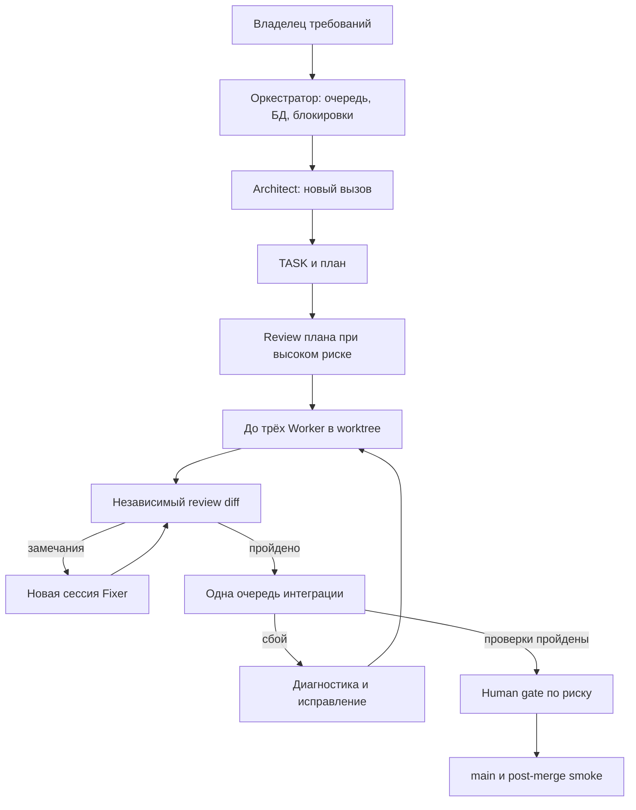
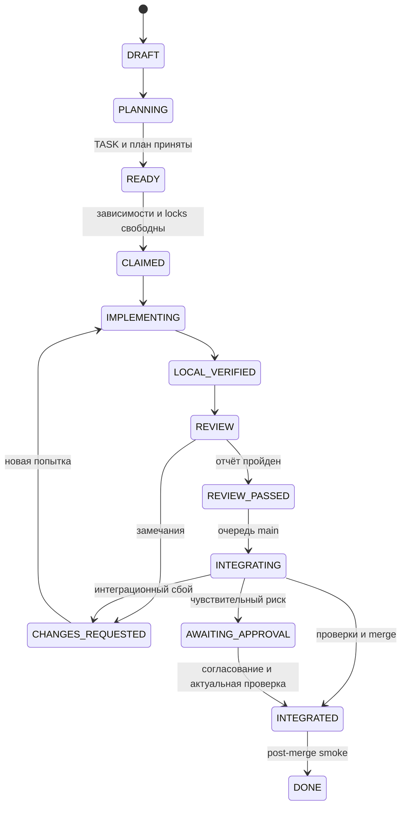

# Архитектура разработки Telegram-iOS Restricted Mode — v1

**Статус:** проектное решение для обсуждения  
**Дата:** 27 сентября 2026 года  
**Область:** организация разработки и интеграции в форке Telegram-iOS

> Документ описывает предполагаемый процесс. Наличие скриптов, тестов, изоляции профилей и конкретных каталогов в репозитории здесь не предполагается. Перед реализацией проверяются фактический код и собираемость проекта.

## 1. Цель и принципы

Организовать параллельную работу над Restricted Mode с независимыми проверками и контролируемым попаданием изменений в `main`. Контекст агентской сессии не является памятью проекта: решения, задачи и результаты фиксируются в файлах и состоянии оркестратора.

Функциональные требования определяются существующими документами. Full Mode сохраняет поведение оригинального клиента; Restricted Mode не реализуется одной лишь фильтрацией UI. Свойства защиты при доступе к файловой системе, отсутствия следов и правдоподобности режима проверяются по реальной реализации и модели угроз. Успешный тест интерфейса сам по себе их не доказывает.

## 2. Источники истины

Авторитетные документы: `restricted_mode/SPEC.md`, `restricted_mode/THREAT_MODEL.md`, `restricted_mode/SECURITY_INVARIANTS.md`. Они имеют приоритет над `AGENTS.md`, `CODING_STANDARDS.md`, TASK, планами Compound Engineering (CE), ADR и ранее накопленными решениями. Вторые версии SPEC или THREAT_MODEL в инженерных каталогах не создаются.

Architect исследует действующий код и предлагает изменения, но не редактирует эти три документа самостоятельно. Конфликт оформляется как `ARCHITECTURE_CHANGE_REQUEST`; затронутая работа приостанавливается до решения владельца требований. Технический ADR не может ослабить инвариант. Если документация Telegram-iOS расходится с кодом, код исследуется и расхождение фиксируется до выдачи задачи Worker.

## 3. Устройство системы



Роли постоянны, сессии одноразовые. Одновременно код пишут не более трёх Workers. Review может выполняться на закреплённом снимке ветки; слияния строго последовательны.

## 4. Роли и полномочия

| Роль | Ответственность | Ограничение |
| --- | --- | --- |
| Владелец требований | Принимает изменения SPEC, модели угроз и инвариантов; решает вопросы чувствительного риска | Не обязан управлять каждым терминалом |
| Оркестратор | Ведёт переходы состояний, зависимости, worktree, resource locks, процессы и очередь интеграции | Не выбирает архитектуру и не отменяет инварианты |
| Architect | Исследует код; предлагает ADR, TASK, зависимости, критерии приёмки | Не пишет production code и не принимает изменения требований |
| Planner | Готовит implementation-ready план конкретного TASK | Не переопределяет TASK и инварианты |
| Worker / Fixer | Исполняет один TASK в своём worktree, проверяет и возвращает свидетельства | Не расширяет scope молча, не меняет требования, не сливает в main |
| Reviewer | Проверяет конкретный diff по TASK, плану, ADR и инвариантам | Не редактирует код во время review |
| Diagnostician | Исследует сбои с воспроизведением | Не проходит мимо gates |
| Интеграционный процесс | Проверяет задачу на актуальном main и выполняет merge | Не пишет функциональный код исподтишка |

Полномочия подкрепляются проверками веток, SHA, изменённых путей, статусов и ресурсов; одних prompt-ов недостаточно. Там, где права технически не ограничены, это процедурное правило, а не гарантия песочницы.

## 5. Размещение

Предлагаемое дерево внутри репозитория:

```text
Telegram-iOS/
├── AGENTS.md
├── CODING_STANDARDS.md
├── restricted_mode/
│   ├── SPEC.md                       # источник истины
│   ├── THREAT_MODEL.md               # источник истины
│   ├── SECURITY_INVARIANTS.md        # источник истины
│   ├── decisions/                   # ADR и запросы на изменения
│   └── engineering/
│       ├── tasks/                   # versioned TASK
│       ├── reviews/                 # отчёты с SHA
│       ├── integration/             # отчёты об интеграции
│       ├── ce/                      # планы и solutions CE
│       └── PROJECT_STATUS.md        # производный отчёт
├── .compound-engineering/config.yaml
└── swarm/
    ├── orchestrator.py              # будущая реализация
    ├── config.yaml
    └── prompts/                     # architect, worker, reviewer, diagnostician
```

В tracked `.compound-engineering/config.yaml` настраивается `docs_root: restricted_mode/engineering/ce`. CE записывает артефакты под этим корнем. TASK, ADR и отчёты оркестратора остаются отдельно.

Изменяемая локальная база `swarm/state.db` исключена из Git. Предусматриваются резервное копирование и восстановление по журналу TASK/review/integration. `PROJECT_STATUS.md` генерируется из состояния и не редактируется агентами; по умолчанию он локальный, чтобы обновления очереди не создавали постоянных коммитов.

Пример размещения worktree на Mac:

```text
~/Work/TelegramClient/
├── telegram-ios/             # основной checkout
└── worktrees/
    ├── TASK-021/             # task/TASK-021-profile-bootstrap
    └── TASK-027/             # task/TASK-027-chat-list
```

Пути уточняются после осмотра checkout. Оркестратор проверяет существующие ветки и незакоммиченные изменения и не удаляет worktree с несохранённой работой.

## 6. Контракт TASK

```yaml
---
id: TASK-021
title: Resolve active profile before account initialization
status: READY
risk: security
depends_on: [TASK-017, TASK-018]
touches: [profile-bootstrap, account-manager]
expected_paths: ["TelegramCore/"]
protected_paths:
  - restricted_mode/SPEC.md
  - restricted_mode/THREAT_MODEL.md
  - restricted_mode/SECURITY_INVARIANTS.md
branch: task/TASK-021-profile-bootstrap
requires_plan_review: true
requires_user_approval: true
---
```

После front matter: **Objective**, ссылки на требования и инварианты, **Acceptance criteria**, **Verification**, **Scope notes**, **Out of scope**, риски и нерешённые вопросы. `expected_paths` — ориентир для ревью, а не абсолютный запрет нужных файлов. `protected_paths` — граница полномочий. Существенное расширение объёма вызывает `SCOPE_EXPANSION_REQUEST` и решение Architect или владельца требований.

Критерии приёмки охватывают Full Mode, Restricted Mode и применимые негативные сценарии: новые сообщения, поиск, уведомления, recent peers, медиа, кэши, расширения и локальные файлы. Конкретный перечень уточняется после исследования потоков данных. Зависимая задача получает READY после интеграции зависимостей в main; работа на предварительном интерфейсном контракте требует отдельного решения и повторной интеграционной проверки.

## 7. Состояния задачи



`BLOCKED` может возникнуть на любой стадии и хранит причину, предыдущую стадию и условие возобновления. Отсутствие ответа на human gate не является согласием. Провал post-merge smoke блокирует дальнейшие интеграции, инициирует исправление или откат и не переводит задачу в DONE.

Переходы транзакционны и выполняются только оркестратором. Каждая попытка хранит номер, запуск, базовый SHA, SHA кандидата, результат, ссылки на свидетельства и время. После сбоя процесса старый PASS не переносится на новый commit.

## 8. Планирование и параллельность

Architect формирует задачи и зависимости из реального кода и источников истины. Planner готовит план исполнения; для `risk: security` и `risk: architecture` независимый review плана обязателен до выдачи Worker. Затрагивающие несколько задач решения фиксируются принятым ADR.

В первой конфигурации максимум три задания реализации. Оркестратор атомарно захватывает логические ресурсы из `touches`: например, две задачи с `profile-bootstrap` одновременно не запускаются, даже если сейчас меняют разные файлы. Architect определяет ресурсы по исследованному коду; обнаруженное Worker пересечение вызывает остановку конфликтующей работы и пересмотр расписания.

Worktree изолирует рабочее дерево, resource lock защищает планирование, а последовательная очередь защищает main. Ни одно из них не заменяет тестирование.

## 9. Реализация и review

Worker получает TASK, утверждённый план и применимые требования, проверяет фактический код, изменяет только своё дерево и выполняет локальные проверки. Он возвращает список файлов, commit SHA, результаты тестов, ограничения проверки и открытые риски. Код возврата процесса Codex сам по себе не считается доказательством PASS.

Review получает чистый закреплённый `head_sha`, определённый `base_sha`, TASK, план, ADR, инварианты и результаты проверок. Reviewer не видит переписку Worker. Незакоммиченные изменения не допускаются к рассмотрению. Любое изменение `head_sha` аннулирует предыдущее заключение.

Каждое замечание включает степень, контекст, воспроизведение или проверяемое обоснование и связь с требованием. Критические и значимые замечания блокируют интеграцию. Fixer — новая сессия в той же ветке; после исправления новый SHA проходит review снова. Остаточные замечания получают явное документированное решение.

Для чувствительных изменений запрашивается полный обзор, включая применимые каналы Postbox, search, notifications, recent peers, shared media, caches, extensions, background processing, filesystem, backups и logging. Review не заменяет практической проверки этих путей.

## 10. Последовательная интеграция и human gate

Один интеграционный lock на main. Процесс для каждой задачи:

1. Проверить, что reviewed `head_sha` не изменился, зависимости в main, замечания закрыты, обязательные результаты есть.
2. На актуальном main создать отдельного кандидата интеграции. Сохранить связь исходного reviewed SHA с новым integration SHA; не выдавать review исходной ветки за review конфликтного ручного исправления.
3. При конфликте записать воспроизведение и направить исправление Worker/Fixer с последующими локальными проверками и review.
4. На новом кандидате выполнить обязательную матрицу сборки, unit/integration и Simulator тестов, включая Full/Restricted сценарии по доступному покрытию. Непроверенное покрытие записать как ограничение.
5. Для security/architecture предоставить владельцу требований TASK, diff, оба SHA, результаты и остаточные риски; получить решение по **этому** кандидату.
6. Перед merge перепроверить SHA main, кандидата, review и согласования. При их изменении повторить затронутые проверки и при необходимости согласование.
7. Слить проверенное дерево, выполнить post-merge smoke и только после успеха отметить DONE.

Обычные задачи могут сливаться автоматически после gates; для security/architecture в v1 требуется явное согласование. Если обязательная проверка недоступна, задача BLOCKED либо ожидает отдельного решения по остаточному риску, но не получает фиктивный PASS.

Если две задачи по отдельности проходят, а вместе ломаются, создаётся `INTEGRATION-xxx` с SHA, логами, воспроизведением, ожидаемым поведением и предполагаемым владельцем. Интеграционный процесс не переписывает функциональный код без отдельной задачи.

## 11. Место Compound Engineering

| Шаг | Инструмент CE | Кто отвечает за результат |
| --- | --- | --- |
| План TASK | `ce-plan` | Planner |
| Review чувствительного плана | `ce-doc-review` | независимая проверка до реализации |
| Реализация и локальная проверка | `ce-work mode:return-to-caller <plan>` | Worker возвращает управление оркестратору |
| Упрощение при необходимости | `ce-simplify-code` | Worker; новый SHA снова проверяется |
| Независимый review | `ce-code-review mode:agent base:<sha> plan:<path>`; при высоком риске `depth:full` | report-only review gate |
| Анализ сбоев | `ce-debug` при применимости | Diagnostician |
| Simulator smoke | `ce-test-xcode` при применимости | интеграция и проектные тесты |
| Накопление знаний | `ce-compound` после интеграции | справочные решения в `ce/solutions/` |

Документация CE показывает примеры вызова вида `/ce-work ...`; фактический способ обращения к skill в установленном Codex (`/ce-*` или `$ce-*`) надо проверить при настройке CLI. Скрипт не должен зашивать синтаксис по памяти. Режим `return-to-caller` завершает CE после реализации и локальной проверки; `mode:agent` возвращает только review. `depth:full` принудительно запускает полный путь review, но не служит доказательством безопасности.

`lfg` не включается в основной pipeline v1, поскольку владеет собственным shipping-циклом. Compound Packs также не добавляются до проверки базового процесса.

## 12. Состояние и восстановление

SQLite хранит `tasks`, `attempts`, `dependencies`, `resource_locks`, `reviews`, `integration_runs`, `approvals` и журнал переходов с версиями TASK/плана и SHA. Один экземпляр оркестратора отвечает за запись. Выдача задания и захват lock атомарны. После перезапуска он сопоставляет БД, Git и сохранённые отчёты; прерванные попытки получают статус расследования, а не PASS.

Производный статус показывает DONE, активные задания, очереди review/integration, BLOCKED с причиной, архитектурные вопросы, последний зелёный SHA main и доступные проверки. Предполагаемый интерфейс `status`, `plan`, `dispatch`, `review`, `integrate`, `retry` — проект API, а не уже существующие команды. Сначала выполняется один ручной цикл, потом создаётся скрипт.

## 13. Процессные инварианты и секреты

- Изменение источников требований требует решения владельца; несовместимый инвариант вызывает остановку затронутой работы.
- Worktree не является изоляцией данных приложения. Граница Full/Restricted проверяется в хранении, потоках чтения и всех поверхностях вывода.
- Отсутствие обязательного теста или невозможность сборки не выдаётся за PASS. Временное исключение имеет владельца, причину, срок и явное решение.
- `api_hash`, токены, provisioning и содержимое личных чатов не записываются в TASK, артефакты CE, логи оркестратора или Git. Воспроизведения обезличиваются.
- Перед параллельными сборками проверяются конфликты Xcode, Bazel, кешей и Simulator на имеющемся Mac.

## 14. Внедрение по этапам

1. Осмотреть fork, текущие три авторитетных документа, состояние сборки и реальные потоки данных.
2. Утвердить этот документ и human gates; подготовить AGENTS, стандарты и шаблоны TASK/ADR/review.
3. Установить CE в нужный профиль Codex, проверить реальные команды и зафиксировать ревизию плагина.
4. Провести ручной пилот с одной небольшой низкорисковой задачей и полным циклом до post-merge smoke.
5. Написать минимальный оркестратор, проверить аварийное восстановление, устаревший review и смену main.
6. После успешного пилота включить максимум три Worker и испытать одну чувствительную задачу с review плана и human gate.

## 15. Открытые решения

1. Какая матрица Xcode/Bazel/Simulator проверок обязательна для разных рисков?
2. Какие отчёты хранить в Git, а какие достаточно резервировать вместе с локальной БД?
3. Как фиксировать согласование владельца и привязывать его к конкретному SHA?
4. Какая стратегия merge сохраняет соответствие проверенного и окончательного дерева?
5. Какие свойства модели угроз реально достижимы на iOS и в нынешнем Telegram-iOS? Это отдельное исследование, а не вывод данного документа.

## Справка об интерфейсе CE

- [Официальный README и установка Codex CLI](https://github.com/EveryInc/compound-engineering-plugin/blob/main/README.md)
- [`ce-work` и `mode:return-to-caller`](https://github.com/EveryInc/compound-engineering-plugin/blob/main/docs/guides/ce-work.md)
- [`ce-code-review`, `mode:agent`, `depth:full`](https://github.com/EveryInc/compound-engineering-plugin/blob/main/docs/guides/ce-code-review.md)
- [Настройка `docs_root`](https://github.com/EveryInc/compound-engineering-plugin/blob/main/docs/guides/configuration.md)

Поведение внешнего инструмента сверяется с фактически установленной версией перед автоматизацией.
