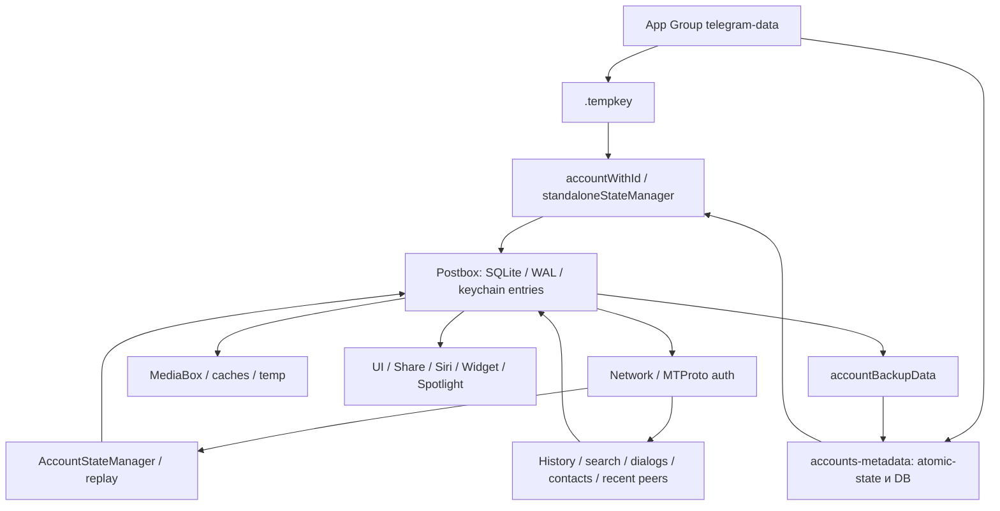

# Карта фактической реализации

Дата: 2026-09-27. Все ссылки E01–E25 относятся к commit `42a84aec8abf72e54958ddf8ca9480514cc0d390`.
Пути ниже относительны корню репозитория. Строки — ориентиры этого commit. Статус **CODE** означает чтение исходника, а не выполнение сценария на устройстве. Карта охватывает главные границы; полный аудит всех ingress/egress-путей ещё не выполнен.

## Реестр свидетельств

| ID | Путь : строка / символ | Что установлено по коду |
|---|---|---|
| E01 | `submodules/TelegramUI/Sources/AppDelegate.swift:663`, `application(_:didFinishLaunchingWithOptions:)`; `:1085` | App Group root, параметры DB, AppLockContextImpl и SharedAccountContextImpl создаются при запуске. `--ui-test` использует отдельный каталог и удаляет его при каждом запуске |
| E02 | `submodules/BuildConfig/Sources/BuildConfig.m:361`, `deviceSpecificEncryptionParameters` | 32 байта ключа + 16 соли читаются/записываются в `.tempkey`; блок обёртки ключа закомментирован. Secure Enclave helper существует отдельно, но этот путь им не защищён |
| E03 | `submodules/TelegramCore/Sources/Account/Account.swift:255`, `accountWithId`; `:11`, `makeExclusiveKeychain` | `root/account…/postbox` открывается до initializedNetwork. MTKeychain использует Postbox entries; эксклюзивность обеспечивается process-local Atomic по AccountRecordId, не межпроцессным разрешением |
| E04 | `submodules/TelegramCore/Sources/Network/Network.swift:1259`, `Keychain`; `:1158`, `Network.request` | Сериализация MT auth dictionary через callbacks Postbox; общий RPC-интерфейс принимает Telegram API payload. В исследованном интерфейсе нет ограничения по blacklist |
| E05 | `submodules/TelegramCore/Sources/Account/Account.swift:1083`, `accountBackupData`; `submodules/TelegramUI/Sources/SharedAccountContext.swift:1151`, `updateAccountBackupData` (вызов :747) | Auth keys DC и notification key копируются в AccountBackupData и attributes записи аккаунта |
| E06 | `submodules/TelegramCore/Sources/SyncCore/SyncCore_AccountBackupDataAttribute.swift:4`, `AccountBackupData`; `submodules/TelegramCore/Sources/AccountManager/AccountManagerImpl.swift:274`, `syncAtomicStateToFile`; `AccountManagerAtomicState.swift:48`, `encode` | Backup содержит ключи, кодируется JSON/Data; atomic-state пишется JSON без дополнительного шифрования в этом пути. Metadata/guard SQLite открываются с encryptionParameters:nil (:88/:98) |
| E07 | `submodules/TelegramCore/Sources/AccountManager/AccountManagerMetadataTable.swift:16`, `PostboxAccessChallengeData` | PIN/password кодируется строкой; этот объект также входит в atomic-state. Использовать его для защищённых Full/Restricted секретов нельзя |
| E08 | `submodules/Postbox/Sources/SqliteValueBox.swift:241`, `openDatabase`; `submodules/Postbox/Sources/Postbox.swift:4641`; `submodules/Postbox/Sources/MediaBox.swift:308`, `storeResourceData` | Backend SQLite с cipher PRAGMA и WAL; `forceEncryptionIfNoSet` управляет шифрованием незашифрованной DB. В AppDelegate он false. MediaBox отдельно пишет переданные Data в файл без шифрования этим методом |
| E09 | `Telegram/NotificationService/Sources/NotificationService.swift:750`, `NotificationServiceHandler.init`; `:900`, `standaloneStateManager`; `:2596`, `serviceExtensionTimeWillExpire` | Extension получает общий root/key/metadata, открывает state manager, читает notification key. Locked влияет на текст. При отсутствии результата timeout возвращает initialContent |
| E10 | `Telegram/BUILD:163`, `minimum_os_version`; `:556`, `official_notification_filtering_fragment` | iOS minimum 13.0. Filtering entitlement добавляется только при сравнении bundle ID с upstream official; наличие права в реальной подписи форка не подтверждено |
| E11 | `submodules/AppLock/Sources/AppLock.swift:101`, `AppLockContextImpl.init`; `:306`, `updateLockState`; `submodules/AppLockState/Sources/AppLockState.swift`, `isAppLocked` | Lock overlay, опциональная биометрия, таймер и `lockState.json`. Отсутствующий файл даёт default LockState. Это не протокол отзыва ключей и закрытия runtime |
| E12 | `submodules/TelegramUI/Sources/SharedAccountContext.swift:637`, подписка accountRecords | Для новых records запускается accountWithId, создаются активные contexts. Нет ожидания Full PIN как условия открытия этой ветви |
| E13 | `submodules/TelegramCore/Sources/Account/Account.swift:1273`, `Account.init`; `:1417` | AccountStateManager, исходящие secret operations, удаления, autoexpire stories и другие managed operations привязаны к Account. `deinit` освобождает disposables, но не доказывает полное стирание памяти |
| E14 | `submodules/TelegramCore/Sources/State/AccountStateManager.swift:863`, `startFirstOperation`; `submodules/TelegramCore/Sources/State/AccountStateManagementUtils.swift:3910`, `replayFinalState` | Difference проходит через state/replay; replay добавляет сообщения (:4260), обновляет общий state (:4797) и peer state (:4802). Фильтрация меняет связанные данные и cursors |
| E15 | `submodules/TelegramCore/Sources/State/Holes.swift:423`, `fetchMessageHistoryHole`; `:1179`, `fetchChatListHole`; `State/FetchChatList.swift:289` | History/getDialogs — отдельные ingress; сообщения и связанные peers пишутся транзакциями (:1036/:1148/:1209), включая additionalMessages |
| E16 | `submodules/TelegramCore/Sources/TelegramEngine/Messages/SearchMessages.swift:308`, `_internal_searchMessages`; `:684`, `_internal_downloadMessage`; `TelegramEngine/Peers/SearchPeers.swift:30`, `_internal_searchPeers` | Поиск может запрашивать getHistory/searchGlobal, загружать peers и связанные данные. Поиск peers обновляет Postbox до возврата UI |
| E17 | `submodules/TelegramCore/Sources/TelegramEngine/Peers/RecentPeers.swift:51`, `_internal_managedUpdatedRecentPeers`; `State/ContactSyncManager.swift:322`, `pushDeviceContactData` | getTopPeers обновляет peers и item cache; контакты имеют отдельные записи. Скрытый chat list этого не закрывает |
| E18 | `Telegram/Share/ShareRootController.swift:42`, `loadView`; `submodules/TelegramUI/Components/ShareExtensionContext/Sources/ShareExtensionContext.swift:183`, `ShareRootControllerImpl` | Share получает `.tempkey`, metadata и accountRecords; отдельный passcode UI (:921) не равен изоляции storage |
| E19 | `Telegram/SiriIntents/IntentHandler.swift:176`, `currentAccount` и обработчики с `isAppLocked`; `Telegram/WidgetKitWidget/TodayViewController.swift:132`, `accountTransaction` | Siri открывает supplementary account, проверяет lock в обработчиках; Widget читает Postbox для выбранных peers. Все ветви команд ещё не аудированы |
| E20 | `submodules/TelegramUI/Sources/WidgetDataContext.swift:92`, `WidgetDataContext`; `SpotlightContacts.swift:29`, `SpotlightIndexStorage`; `SharedAccountContext.swift:1064` | Widget/notification presentation JSON и Spotlight data.json/аватары вне основной истории; контексты подписаны на активные accounts. Spotlight включается intents setting, не Restricted policy; в update есть прямой print имени/фамилии (:124), вне Logger redaction |
| E21 | `submodules/TelegramCallsUI/Sources/PresentationCallManager.swift:319`, `ringingStatesUpdated`; `CallKitIntegration.swift:247`, `reportIncomingCall`; `:91`, `donateIntent` (вызов из startCall :63) | CallKit получает handle/title и системный входящий вызов; INInteraction передаёт call intent с peer identity. Доставка и история на устройстве не проверены |
| E22 | `submodules/TelegramUI/Sources/AppDelegate.swift:1899`, `applicationWillResignActive`; `:1926`, `applicationDidEnterBackground` | Background продлевает работу wakeup manager, чистит caches и обновляет activity signals; не закрывает здесь все account runtimes. Полнота lifecycle callbacks/scene paths не доказана |
| E23 | `submodules/Postbox/Sources/TempBox.swift:155`, `initializeShared`; `AppDelegate.swift:657`, logging defaults | Temp по process/launch; debug file logging включён с redaction. Redaction не доказательство отсутствия peer IDs, ключей или контента во всех логах |
| E24 | `submodules/TelegramCore/Sources/SyncCore/SyncCore_SecretChatKeychain.swift:93`, `SecretChatKeychain`; `Account.swift:1417`; `Network/FetchedMediaResource.swift:73`, `fetchedMediaResource` | Secret keys сериализуются в Postbox-модель; secret operations и media fetching требуют самостоятельного ownership/cleanup. Полный secret-chat protocol не проверен |
| E25 | `Telegram/Tests/Sources/UITests.swift:29`, `testLaunch`; `Telegram/BUILD:1863`, `iOSAppUITestSuite`; `Tests/AllTests/BUILD`; `State/Serialization.swift:262`, `currentLayer` | Есть launch/signup UI tests и общий suite TgCallsTests, но не доказанное Restricted-покрытие. Bazel UI runner требует iOS 26.2; установлен 26.5. Локальный API layer 228 |

## Потоки данных baseline

Схема показывает исследованные связи CODE; порядок всех асинхронных операций запуском не подтверждён. Notification Service открывает собственный standaloneStateManager на общих данных и не ограничивается чтением готового текста.

## Инвентаризация секретов и stores

| Объект | Место / владельцы | Риск для Restricted |
|---|---|---|
| App PIN | metadata challenge и atomic-state; main/Share | Строковая сериализация; не KDF verifier и не ключевой барьер |
| DB key/salt | `.tempkey`; main и extensions | Копия root содержит материал для исследованного пути DB; системная Data Protection оценивается отдельно |
| DC auth keys | Postbox MTKeychain и AccountBackupData в metadata | Закрыть только Full DB недостаточно: остаётся резервный путь |
| Notification key | Postbox master-notification-secret, backup metadata | Доступность расширению и поведение Locked требуют отдельного решения |
| Login tokens | JSON-файл AccountManager (getLoginTokens/setLoginTokens) | Дополнительный материал авторизации; должен попасть в key inventory |
| История / state / индексы | Postbox SQLite, WAL/SHM, caches | Физическое удаление не подтверждено; шифрование не следует из наличия параметров |
| Media / thumbnails | account MediaBox, metadata MediaBox, temp | Нет единого PIN-bound шифрования на уровне показанного storeResourceData |
| Secret-chat keys | SecretChatKeychain и связанные peer states/operations | Не переносить в Restricted по аналогии с облачными чатами |
| System-derived данные | Spotlight, widgets, CallKit, notifications, Photos/Files | Не ограничены одной транзакцией Postbox |

## Что переиспользовать и что нельзя считать готовой защитой

Кандидаты повторного использования: accountWithId как место открытия после проверки доступа; ValueBox encryption/rebuild после проверки; существующие Signal/Disposable и master ownership; TempBox cleanup; AppLock covering view; отдельный каталог `--ui-test`; действующие Bazel targets.

Не считать готовыми гарантиями: makeExclusiveKeychain (только один процесс), supplementary flag, AppLock overlay, clearCaches, deinit, media file deletion, Data Protection без анализа класса файлов и угроз. Для Restricted нужно проверить все неявные открытия Full, а также fallback `removeDatabaseOnError` при ошибке ключа.

## Неполное покрытие

Точки stories, contacts, calls и exports найдены, но их полный граф не восстановлен. ChatListView/MessageHistoryView и UI consumers найдены; все ветви folder/archive/counters/forward/shared media/navigation не прочитаны целиком. Live Activities/App Intents/CarPlay: поиск выбранных символов не доказывает отсутствия, найдено `.allowInCarPlay`; нужна инвентаризация всех bundled targets и capabilities. Watch имеет отдельный исходный проект/TDLib; его независимый аккаунт и зеркалирование push не исследованы. Backup restore, реальные файлы/Keychain и личные данные не открывались. Эти пробелы отражены в 06/08, а не выданы за PASS.
