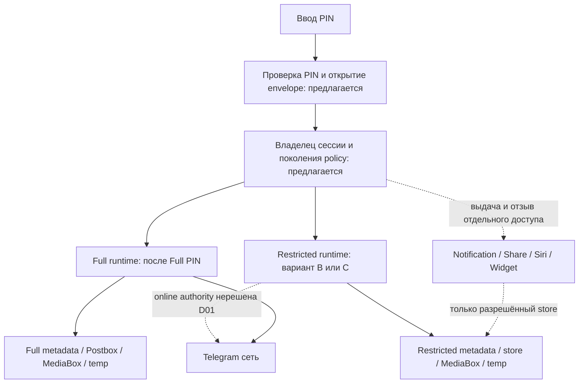
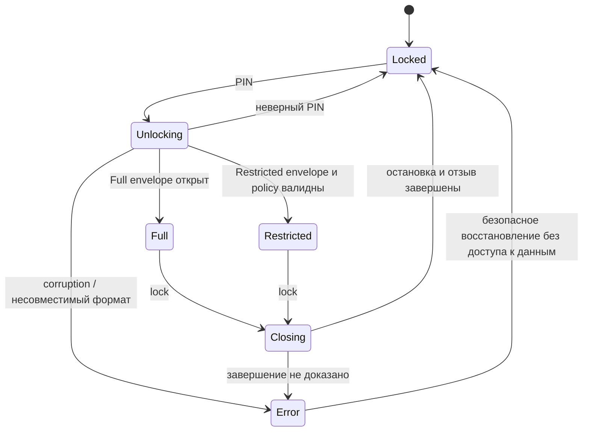
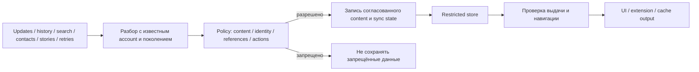
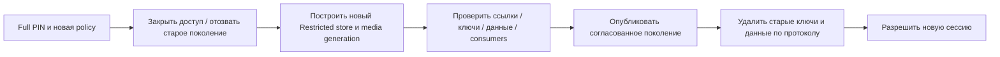
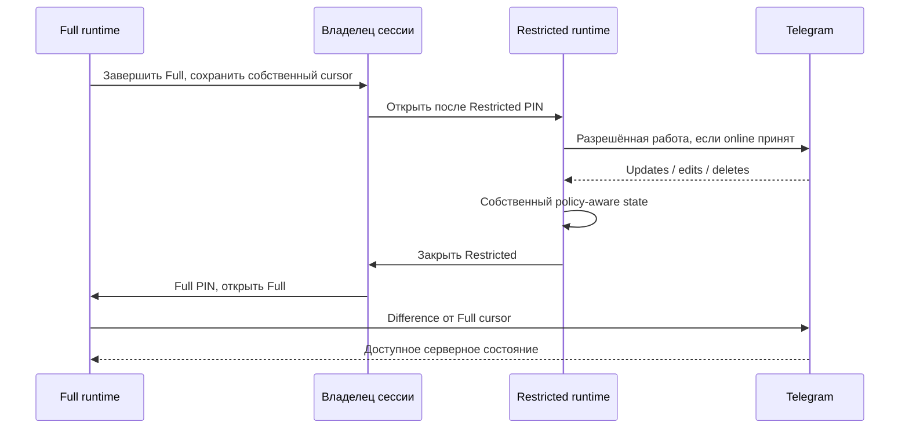

# Условный проект границ доступа

Дата: 2026-09-27. Commit: `42a84aec8abf72e54958ddf8ca9480514cc0d390`.
**Proposed / условный проект. Ни один новый компонент ниже не реализован и не принят.**
Выбор B/C, online authority и T-уровней заблокирован D01. Здесь зафиксированы обязанности компонентов, а не новые модули, которые следует автоматически создать.

## Граница процессов, ключей и данных

App Group остаётся файловой общей областью, не криптографической границей. Проверка флага «последний режим» не даёт полномочий открыть Full. Нужно проверить bootstrap **до** accountWithId/standaloneStateManager и до чтения secret-bearing metadata (E01/E03/E06/E09/E18/E19).

### Envelope и открытие

Предложение: случайные отдельные DEK для профилей и классов данных; обёртка отдельными KEK после PIN/KDF, при обосновании — дополнительный device-bound secret. AEAD аутентифицирует version/profile/policy-generation и метаданные формата; уникальные nonce, версии KDF и измеренные параметры обязательны. Готовый алгоритм/библиотека пока не выбраны: исследование доступных криптобиблиотек и benchmark входят в STORAGE-01. Запрет самодельной схемы остаётся.

Plaintext `.tempkey`, challenge, AccountBackupData и login tokens должны быть исключены из общей доступной области для выбранной модели. Изменение PIN переоборачивает ключи по проверенному crash-safe протоколу; компрометация старого ключа требует отдельной ротации/перешифрования. Ошибка unwrap не должна вызывать removeDatabaseOnError и потерю Full. Потеря device key, backup restore и забытый PIN не разрешают автоматический Full; recovery/data-loss policy принимает владелец D07.

## Lifecycle

При входе в Closing сразу закрыть визуальное содержимое и запретить новые чувствительные операции. Затем отозвать generation/capabilities, отменить requests/downloads/subscriptions, остановить writers и extensions, закрыть handles и runtime. Новый профиль не активируется, пока старый не завершён безопасно. На cold start разрешения прошлой сессии не наследуются. Очереди старых callbacks проверяют generation и перед обработкой, и перед commit/output.

Signal disposables, существующий master ownership и AppLock cover — кандидаты повторного использования, но гарантию teardown ещё нужно доказать LIFE-01. Межпроцессный протокол не заменяется process-local makeExclusiveKeychain. Стирание всех копий Swift/ObjC памяти не заявляется. Lock-on-background — только кандидат D06; detection системной блокировки проверяется на физическом устройстве.

## Входящие данные

Это функциональная граница, а не решение поместить всю логику в один класс. Нужны все ingress из E14–E17/E24, связанные messages, peer metadata, resource downloads и UI side effects. Отбрасывание контента не должно терять учёт последовательностей; допустимость скрытых peer IDs в sync state решается D02. При online T4 весь процесс с полной авторизацией может обойти эти проверки — конфликт D01 сохраняется.

## Изменение blacklist

Если crash случился между шагами, доступ остаётся закрыт до проверки согласованности. Одна DB-транзакция не атомарна с файлами, Keychain и системными notifications. Публикация должна быть восстанавливаемой, старые процессы не могут писать под старой policy. Удалённые backup/exports вне приложения не считаются стёртыми. Защита от rollback T2 с возможностью записи требует доверенного источника поколения; его наличие не доказано.

## Возврат Full и владение синхронизацией

Нельзя переносить Restricted cursor в FullStore, который не получил соответствующие сообщения. Нет обещания восстановить сообщения, появившиеся и исчезнувшие на сервере за время отсутствия Full. Secret-chat qts/keys/очереди, outgoing messages, read state и edits/deletes требуют отдельного SYNC-01. Два одновременных обычных Account на одном auth/store не разрешаются по умолчанию. Разные MTProto sessions на общих полномочиях также не доказывают независимое безопасное состояние.

## Предлагаемый контракт внешних процессов

Для каждой ячейки: store/ключи, операции, аутентификация, fallback; тесты — 06. Таблица **целевая**, текущая реализация описана в 02.

| Процесс/поверхность | Full | Restricted | Locked / ошибка |
|---|---|---|---|
| Main | Full keys/store после Full PIN; штатные функции с принятыми исключениями | Только Restricted keys/store; policy на read/write/actions после Restricted PIN | Нет content keys и чувствительных операций; PIN/error UI |
| Notification Service | Отдельное разрешение и срок доступа; сохранение Full функций требует D03/D06 | Только разрешённые payload/keys/store; никаких скрытых writes | Недоступность Full обязательна; ожидаемое уведомление и OS fallback нерешены D03 |
| Share | Full PIN и ограниченная сессия для чтения/отправки | Restricted PIN, разрешённые peers и действия | Заблокированный вход, без автоматического Full/Restricted |
| Siri / intents | Отдельно подтверждённые полномочия; совместимость Full D08 | Только policy-scoped команды; raw Account не выдаётся | Без sensitive output; системное fallback проверить |
| Widget / Spotlight | Данные, разрешённые согласованной политикой внешнего вывода | Только очищенная projection, включая старые snapshots/индексы | Neutral output; очистка системных копий не доказана |
| CallKit / VoIP | Действующие вызовы после решения о lifecycle | Разрешённые вызовы до reportIncomingCall/intent donation | Требуется D03/D06; нельзя обещать отсутствие системного следа |
| Watch / CarPlay / Live Activities / иные targets | Сначала inventory и разрешения D08 | Никаких неаудированных обходов | Неизвестное покрытие блокирует production; отключение функций требует согласования |

Отдельные capability tokens не объявляются криптографической защитой от T4 в том же процессе. Full background notifications и отсутствие Full keys при Locked могут конфликтовать; решение нельзя спрятать в реализации extension.
