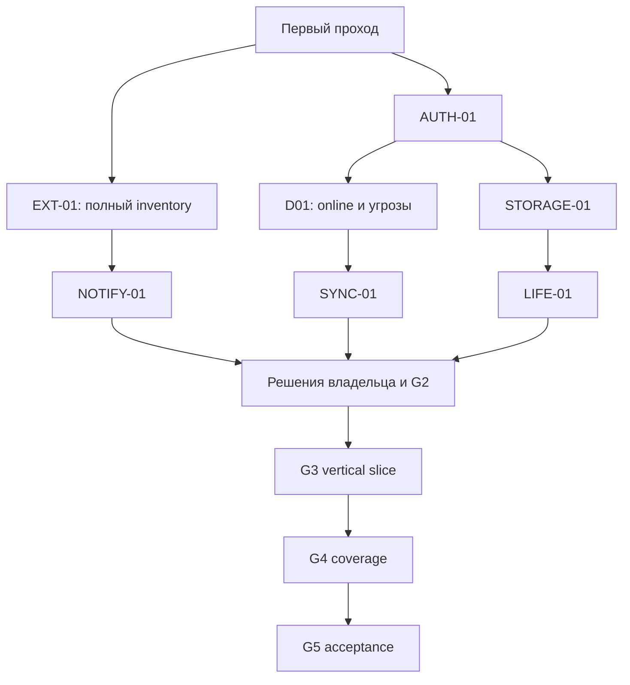

# План этапов

Дата: 2026-09-27. Commit: `42a84aec8abf72e54958ddf8ca9480514cc0d390`.
Статус: **READY FOR SPIKES — задания подготовлены; production implementation BLOCKED**.
Требования DRAFT; новые ADR Proposed. Автоматическое выполнение экспериментов и реализация этим отчётом не разрешаются.

| Этап | Вход | Работа / выход | Gate |
|---|---|---|---|
| G0 Baseline | Brief и checkout | Состояние Git/submodules, карта CODE, build/smoke результат, явно непроверенное покрытие | Этот первый проход; 00 содержит фактический результат |
| G1 Feasibility | Задания 08 и отдельное разрешение на experiments | AUTH-01 → STORAGE-01; NOTIFY-01, SYNC-01, LIFE-01; инвентаризация оставшихся surfaces | Измеримые результаты, root causes и решения D01–D09; не UI-прототип вместо доказательств |
| G2 Architecture | Утверждённые SPEC/THREAT_MODEL/INVARIANTS, доказательства G1 | Выбор B/C или отказ от них; ADR; точные interfaces/ownership/migration | Владелец принимает решения; независимый review чувствительного плана |
| G3 Vertical slice | Принятый G2; готовая verification infrastructure | Один аккаунт, visible/hidden cloud chat; PIN → keys → store → ingress → output → lock → Full recovery | I01–I09 и V01–V11 применимого scope; Full regression; ограничения только согласованные |
| G4 Coverage | Зелёный vertical slice | Search, groups/topics, folders, counts, forward/references, shared media, contacts, stories, calls, extensions | Полная path matrix; неизвестный путь не допускается в protected release |
| G5 Acceptance | Все обязательные surfaces реализованы | Миграции/restore/rotation, device/security tests, upstream regression и независимое review | Принятая модель угроз доказана в указанных пределах; только после этого реальное использование |

## Зависимости

Это зависимости работ, не команда запустить несколько агентов. В первом проходе ни Workers, ни orchestrator не запускались.

## Интеграция и rollback

Работы реализации декомпозировать после G1: до выбора API/storage нельзя выдавать placeholder architecture за implementation-ready план. Зависимые TASK получают READY после принятия интерфейсов/интеграции зависимостей. Свидетельства привязаны к base/head SHA; изменение кода отменяет старый PASS. Интеграция на актуальном main и независимое review следуют утверждённому workflow; существующее AGENTS не разрешает commit/merge/push без явной команды.

Rollback кода не должен запускать старую версию над новым форматом или раскрывать Full. Миграции требуют version gate, резервирования только защищённых данных, проверки восстановления и отказа старого binary при несовместимом формате. Конкретный протокол после STORAGE-01. Потеря baseline build блокирует интеграцию, но не независимый анализ.

## Что не делать до закрытия G1

Не создавать production модули по названиям из схем; не копировать auth material между стандартными Account runtimes без проверки; не менять signing/config; не отключать функции Full ради сборки; не заменять отсутствующие device tests Simulator PASS; не переносить draft требования в authoritative файлы без решения владельца.
